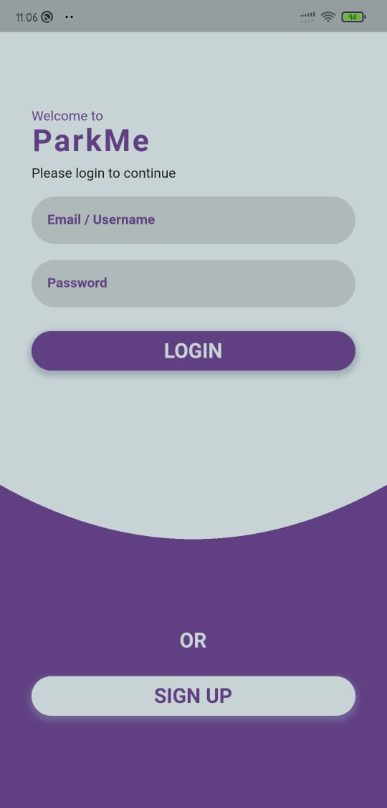

<div align="center">


[](https://flutter.dev/docs)
[]( "Firestore")
[](https://nodejs.org/en/)
[](https://code.visualstudio.com/  "Visual Studio Code")

</div><p align="center">
  <a href="" rel="noopener">
 </a>
 
</p>
<h1 align = 'center'><b>Park ME</b></h1>

## Description ##

<p>
  On any given working day approximately 40% of the roads in urban India are taken up for just parking the cars !!!
  The global average of time spent looking for a parking spot is 20 minutes,If we could somehow minimize this time it could save people a lot of time daily.
  We have developed a mobile app that can help people find parking spots around their current location easily and on-demand
  .A simple hassle-free process that involves pulling up into the parking spot and engaging it at the click of a button.
  We incorporate the use of a image recognition model that automatically detects whether the parking spot is empty or full
<p>
For more details-
<a href="https://youtu.be/2Von_17aYw0">
Youtube link 
</a>
</p>


------------------------------------------
## Features ##
- Easily find empty parking spots nearby.
- Get directions to the parking spot of your choice.
- Host your own parking space and get paid for it.
- Easy check-in to the spot after pulling in.
- Be charged on hourly basis for the use of the parking space.
- User authentication.


------------------------------------------
## Demo ##
Sign Up/Sign In

<!--  -->
 </a>
 <br>
 </a>
 <br>
 </a>
 <br>

 </a>
 <br>

 </a>
 <br>

 </a>
 <br>

 </a>
 <br>

 </a>
 <br>

 </a>


------------------------------------------

## How To Use
#### Software Requirements
VSCode or Android Studio

## Installation
Install the dependencies by running:
```html  
npm install
```
```html  
flutter pub get
```


#### Run using Command Prompt
```html
    node start
```

```html
    flutter run
```

---
###             Tech stack

`Frontend` : Flutter  <br>
`Backend` : Nodejs  <br>
`Database` : MongoDB <br>

------------------------------------------

<h3 align="center"><b>Developed  by <a href="https://github.com/deepanshu2506">Deepanshu Vangani</a> , <a href="https://github.com/Parth18Shah">Parth Shah</a> , <a href="https://github.com/Sakshi107">Sakshi Shelar</a> and <a href="https://github.com/hiral72">Hiral Sheth</a></b></h3>


!
